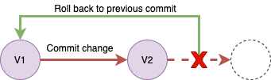

Note: this is not a comprehensive and exhaustive tutorial, but should be enough to get you started.   

# Prerequisites
- Basic unix commands (ls, cd, mkdir, pwd, echo, cat) on terminals

# Installing Git Locally:
1. MacOS: `brew install git` or `https://sourceforge.net/projects/git-osx-installer/`
2. Linux
    * debian based: `sudo apt install git`
    * Fedora based: `sude dnf install git`
3. Windows: `https://git-scm.com/download/win`

Notes:

1. By "locally" we mean the workspace that you're working on. If you installed git in your desktop but use it on a VM, it won't work.
2. Test if successfully installed: `git --version`
3. How to install Github? --> you don't have to if you follow this tutorial.

# Version Control
The most important feature of Git is **version control**. 

It keeps track of the previous versions of your work, and can revert your project back to previous versions when something went wrong. To better understand this idea, let's take a look at the following visualization. 

As shown here, each node in the workflow is a version, which is essentially a snapshot of all files when the node is created. In Git terminology, we call those nodes "**commits**" and the action of creating those nodes as "**commit changes**". This will usually happen when you made a great progress, archived a milestone, or even fixed a bug. Note the word "commit" can be either a verb or a noun here.



In the following experiment, let's open up a command line interface application like Terminal (MacOS or Linux), Command Prompt or similar (Windows) or launch VS Code and open a Terminal.

### Init Git, Add and Commit changes
First, we create a directory and initialize Git in it. The ```git init``` command tells git to treat your current directory as a git repo(sitory). In git terminology, this directory is a "**working directory/tree**". Git will create a hidden folder called ".git" in the current directory. Note this is an one-time-only command: once a git repo is established, you don't need to re-init it every time you commit changes.

```
$ mkdir git-intro
$ cd git-intro
$ git init . # use . to identify the current directory as a git repo
Initialized empty Git repository in /Users/jerric/workspace/workshop/git-intro/.git/
$ ls -a
.	..	.git
```

Then let's create some dummy files.

```
$ echo "hello world" > myfile.txt
$ echo "hello world again" > myotherfile.txt
$ ls -a
.	..	.git      myfile.txt		myotherfile.txt
```

Use ```git status``` to check what's been changed since last commit. Since we haven't committed any changes, the message indicate we have "No commits yet". It also prompted us that we have two "**untracked**" files. This is because we just created them and yet haven't commit this change.

```
$ git status

On branch main

No commits yet

Untracked files:
  (use "git add <file>..." to include in what will be committed)
	myfile.txt
	myotherfile.txt

nothing added to commit but untracked files present (use "git add" to track)
```

Now, let's **track** these two files and commit this change. To commit a change, we need to go through two steps: ```git add``` + ```git commit```.

```git add``` is the command that adds files that you want to track into a "**staging area/index**". The staging area serves as an intermediate space before you actually commit the changes. You can add new files into, remove files from, and modify files in the staging area without making any actual commit. Once the files are put into the staging area, they are considered as "**tracked**" files.

```
$ git add myfile.txt
$ git add myotherfile.txt
$ git status

On branch main

No commits yet

Changes to be committed:
  (use "git rm --cached <file>..." to unstage)
	new file:   myfile.txt
	new file:   myotherfile.txt
```

```git commit``` command creates a new commit. As we introduced before, a commit is essentially a snapshot of every tracked files when the commit is created. More specifically, what this command actually does is to take whatever you put into the staging area and record the changes made on them since the last commit. The files that haven't been put into the staging area (a.k.a untracked files) will be neglected, so their changes won't be recorded by this commit. Note we usually use ```-m``` flag to append some messages to describe what've been done in this commit.

```
$ git commit -m 'created two txt files'

[main (root-commit) cf34f6a] created two txt files
 2 files changed, 2 insertions(+)
 create mode 100644 myfile.txt
 create mode 100644 myotherfile.txt
```

Use ```git log``` to check the commit history. You may have to press enter to scroll to the bottom, and press `q` to quit. Above we see a complete list of all the changes that we have made, as well as the unique hash id of each commit. What we have here tells us the files change history, when the changes were made, and by whom they were made.

```
$ git log

commit a98898cda9cb78f18951a588cd288ae675e3cda0 (HEAD -> master)
Author: Jerric Chen <jerric@Jerrics-MacBook-Air.local>
Date:   Thu Jul 8 22:56:15 2021 -0600

    created two txt files
```


### Track changes and Recover from changes

Now, to demostrate how this version control can work, let's change our files a little bit and commit this change so as to create another version of the project

```
$ echo "adding other stuff" >> myfile.txt
$ echo “same here” >> myotherfile.txt
$ git add myfile.txt
$ git add myotherfile.txt
$ git commit -m 'made changes to the two files'
[main 414c43b] made changes to the two files
 2 files changed, 2 insertions(+)
```

Now, since we have two commits, let's experiment on the **roll-back** feature: Suppose you made some more changes to myfile.txt beyond our last commit and are not satisfied with our recent change, and most importantly, you **haven't** committed this change, then you can easily recover this single file with `git checkout` as follows

```
$ echo "adding other stuff for the second time" >> myfile.txt 

$ cat myfile.txt
hello world
adding other stuff
adding other stuff for the second time

$ git checkout -- myfile.txt

Updated 1 path from the index
```

You can see that your changes have been reverted in your **working directory**. Neat! 


```
$ cat myfile.txt
hello world
adding other stuff
```

Internally, ```git checkout``` restores your files to match with the **staging area**. Since the staging area happens to have just been synced with the snapshot of your last commit when you committed last time, what you essentially see here is that you have rolled-back to the last commit. 

So, what about committed changes? If undesired changes are committed, we can jump back to a previous commit to "cancel" it! Now it's recommended to use ```git reset``` or ```git revert``` ([difference](https://images.app.goo.gl/QrBscJmeFxi5pd2EA)). Let's use `git reset` as an example:

- Step 1: Find the hash id of a good commit from the output of `git log`


```bash
$ git log

commit 414c43b409702338f74dee46faac37e6467d3bcf (HEAD -> main)
Author: TeppieC <jerric.chen@cybera.ca>
Date:   Mon Jul 19 16:30:12 2021 -0600

    made changes to the two files

commit cf34f6a0f371b048527a6eec41dc441ac4510e7e
Author: TeppieC <jerric.chen@cybera.ca>
Date:   Mon Jul 19 16:16:52 2021 -0600

    created two txt files
```
- Step 2: reset to this version with `--hard` argument and the commit's hash id.

```
$ git reset --hard cf34f6a0f371b048527a6eec41dc441ac4510e7e

HEAD is now at a98898c created two txt files

$ cat myfile.txt
hello world
```
Now everything is back to what it used to look like in our previous commit. Note if you are collaborating with teammates on a project, it's more recommended to use `git revert` than `git reset` as the latter will discard commits and disturb your teammate's work.

In summary, the rule of thumb of using Git is "**commit often**" because when some parts of your work went wrong, you can always rely on this benefit of git to roll back your project to a previous commit and start over. 

Till now, we are solely working locally. In the next section, let's talk about working remotely with the help from Github.


# Collaboration
## Interacting with Github
Github is an extension of Git. It is a open-source community where you can share yours and access other's work, or use it as a tool to collaborate with others and manage the project. 

### Creating a repo
Github manages software projects in the way of **repo(es)**. To host your code on github and collaborate with your teammates, you'll need to create a **remote** repo that is at least accessible to your teammates. They are default to be public repos so that every one can see it. With github student pack, you can create private repos and share it only to your collaborators.

Now let's try to create a repo named "github-intro".

### Clone
The clone command lets you have a **local** copy of the remote repo on github. To clone the repo we just created, open a terminal and navigate to a directory you would like this repo to live, then type (note: please substitube content in bracket with your github username and you may be prompted to enter a username/password if this is a private repo.):

```bash
$ git clone https://github.com/[YOUR_GITHUB_USERNAME]/github-intro.git

Cloning into 'github-intro'...
remote: Enumerating objects: 3, done.
remote: Counting objects: 100% (3/3), done.
remote: Total 3 (delta 0), reused 0 (delta 0), pack-reused 0
Receiving objects: 100% (3/3), done.

$ cd github-intro
```

You don't need to do `git init` for repos created from github as they are automatically initialized as git repos. As a sanity check, let's type the following

```bash
$ git status

On branch main
Your branch is up to date with 'origin/main'.

nothing to commit, working tree clean
```

### Pull
The pull command fetches the newest updates (from your collaborator's changes) from the remote (github repo) and merge that update to your local (the local directory that you just cloned from github). Because no one has been working on this project since our last pull/clone, it prompts us with "already up to date". 

```
$ git pull

Already up to date.
```

### Push
Use ```git push``` to upload your local changes (a.k.a. commits) to the remote github repo. 

```
$ echo "I learned github" > afile.txt
$ git add afile.txt
$ git commit -m 'added afile'
$ git push

Enumerating objects: 4, done.
Counting objects: 100% (4/4), done.
Delta compression using up to 8 threads
Compressing objects: 100% (2/2), done.
Writing objects: 100% (3/3), 311 bytes | 311.00 KiB/s, done.
Total 3 (delta 0), reused 0 (delta 0), pack-reused 0
To https://github.com/TeppieC/github-intro.git
   9abb950..8397048  main -> main

```
Now check your github repo and you will see this commit, so do your teammates.

## Using branches
If you're making changes to someone elses repository, or if you're collaborating with someone, or even just trying something new, Git offers a great option called "branch(es)". 


To see all available branches. 

```bash
$ git branch -a

* main
  remotes/origin/HEAD -> origin/main
  remotes/origin/main
```

Note there are some of them are local branches and some are remote ones. The asterisk sign indicates that we are currently on a "main" branch. "remotes/origin" is our github repo, it also has a main branch, which could sometimes becomes inconsistent with our local main branch.

To create a new branch just for you

```bash
$ git branch MyNewBranch
```

and switch to this branch 

```bash
$ git checkout MyNewBranch

Switched to branch 'MyNewBranch'
```

this will copy all the code of the branch you're currently on, into a new branch where you don't have to worry about ruining someone's (or your own) hard work. This can be done with the following git command. You can return to your previous branch at any time with `git checkout [AnotherBranch]` 

Now that you're on your new branch, let's create a new file

```bash
echo "I created a branch" > myfileinbranch.txt
```

then let's see our git changes 

```bash
$ git status

On branch MyNewBranch
Untracked files:
  (use "git add <file>..." to include in what will be committed)
	myfileinbranch.txt

nothing added to commit but untracked files present (use "git add" to track)
```

where we can now add these files to github and commit them :

```bash
$ git add myfileinbranch.txt
$ git commit -m 'commiting file to my branch' 
 [MyNewBranch eaea361] commiting file to my branch
 1 file changed, 1 insertion(+)
 create mode 100644 myfileinbranch.txt
 
$ ls
LICENSE afile.txt myfileinbranch.txt

$ git log
commit eaea3618370114d5e8243d1c4b355afe5edf0ad7 (HEAD -> MyNewBranch, origin/MyNewBranch)
Author: Jerric Chen <jerric@Jerrics-MacBook-Air.local>
Date:   Fri Jul 9 00:43:16 2021 -0600

    commiting file to my branch

commit 839704864b89f519c25bf698e843c4511dd8004c (origin/main, origin/HEAD, main)
Author: Jerric Chen <jerric@Jerrics-MacBook-Air.local>
Date:   Fri Jul 9 00:36:40 2021 -0600

    added afile.txt

commit 9abb950249422e54e3931b992cb68e5c9ae85b6d
Author: TeppieC <TeppieC@users.noreply.github.com>
Date:   Fri Jul 9 00:29:37 2021 -0600

    Initial commit
```

Finally we push: 

```bash 
$ git push

fatal: The current branch MyNewBranch has no upstream branch.
To push the current branch and set the remote as upstream, use

    git push --set-upstream origin MyNewBranch
```

Okay now git is complaining an issue here. This is because we forgot to tell github that we have a new branch locally. We can fix that by doing what many before us have failed to do: Reading the error message and doing exactly what it tells us

```bash
$ git push --set-upstream origin MyNewBranch

Enumerating objects: 4, done.
Counting objects: 100% (4/4), done.
Delta compression using up to 8 threads
Compressing objects: 100% (2/2), done.
Writing objects: 100% (3/3), 358 bytes | 358.00 KiB/s, done.
Total 3 (delta 0), reused 0 (delta 0), pack-reused 0
remote: 
remote: Create a pull request for 'MyNewBranch' on GitHub by visiting:
remote:      https://github.com/TeppieC/github-intro/pull/new/MyNewBranch
remote: 
To https://github.com/TeppieC/github-intro.git
 * [new branch]      MyNewBranch -> MyNewBranch
Branch 'MyNewBranch' set up to track remote branch 'MyNewBranch' from 'origin'.
```
Now if we go back to github, you'll see we have a new branch with updated files there.

To better observe how branch works, let's try switch back to the main branch where we were initially at

``` 
$ git checkout main
Switched to branch 'main'
Your branch is up to date with 'origin/main'.

$ ls
README.md	afile.txt

$ git log 
commit 839704864b89f519c25bf698e843c4511dd8004c (HEAD -> main, origin/main, origin/HEAD)
Author: Jerric Chen <jerric@Jerrics-MacBook-Air.local>
Date:   Fri Jul 9 00:36:40 2021 -0600

    added afile.txt

commit 9abb950249422e54e3931b992cb68e5c9ae85b6d
Author: TeppieC <TeppieC@users.noreply.github.com>
Date:   Fri Jul 9 00:29:37 2021 -0600

    Initial commit

```
The new file doesn't exist in the main branch, and neither does the new commit.

### Pull request
Different branches serve different purposes. Conventionally, the **master/main** branch is where you publish releases. In smaller projects, this can also be a place where stable and working code stays at. If you are still experimenting with your ideas, it's important to write on your own branch (i.e. **dev**) so that your changes won't affect others' work. Once you are done, it's time to merge your code on your own branch to the master/main branch, we do it through a process called **pull request (PR)**. Pull request is a collaborative process where your teammates can step in and review your work so that your mistake will be caught before it ruining the whole project. For more on pull request, check [here](https://docs.github.com/en/pull-requests/collaborating-with-pull-requests/proposing-changes-to-your-work-with-pull-requests/creating-a-pull-request#creating-the-pull-request).


### Merge
If your work is not in conflict with that on the master/main branch, your branch **merge** to the master branch should work smoothly. That means you only need to click on the "merge" button to complete the process. However, sometimes your teammates are also working on the same file as you're working on it, and they merged to the master branch earlier than you, then you will have **conflict** and won't benefit from this "auto-merge" anymore. The proper way to solve this is to manually resolve the conflict. Let's see how to do that on github. Note in group projects, merging to master usually requires an approval from other team members, you can ask someone from the team to review your changes (you can request a reviewer when creating the pull request) to make sure your changes are functional and complete.

Merge not only happens in pull request. It can also happen when you are pulling new changes from remote to local or performing local branch merges. That means sometimes you'll have to manually resolve merge conflicts in your terminal. This will open up your vim editor and ask you to address the conflict in a similar way. 


## Preventing Yourself From Committing Things You Shouldn't

Suppose we have all our passwords stored in a file in our git directory. It would be a very bad idea to commit that. For example, let's have a `all_my_passwords.txt` as follows:

```
netflix: SuperSecretSuperSecurePasswordIHopeNoOneGetsToReadThatWouldBeBad
```

We certainly don't want to commit that. But sometimes we need to have our passwords to access data/other resources. How do we make sure we don't accidentally send these to github?

With a "hidden" file called `.gitignore` , where we can list the files, directories, or filetypes that we don't want to commit to github. Now let's create it! 

```bash
$ echo "all_my_passwords.txt" >> .gitignore

$ cat .gitignore
all_my_passwords.txt
```

Let's commit this to git 

```bash
$ git add .gitignore
$ git commit -m "adding files to ignore on git" 
```

Protections are built to prevent us from accidentally commiting this file now

```bash
$ git add all_my_passwords.txt

The following paths are ignored by one of your .gitignore files:
all_my_passwords.txt
hint: Use -f if you really want to add them.
hint: Turn this message off by running
hint: "git config advice.addIgnoredFile false"
```

# Github desktop
https://desktop.github.com/

# Additional resources
- A useful cheatsheet: http://rogerdudler.github.io/git-guide/
- The git documentation is always your best friend: https://git-scm.com/docs

